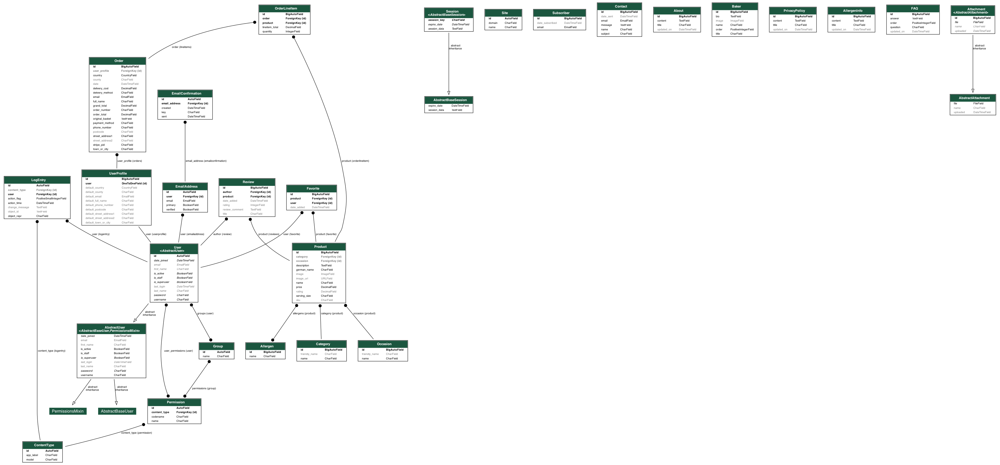
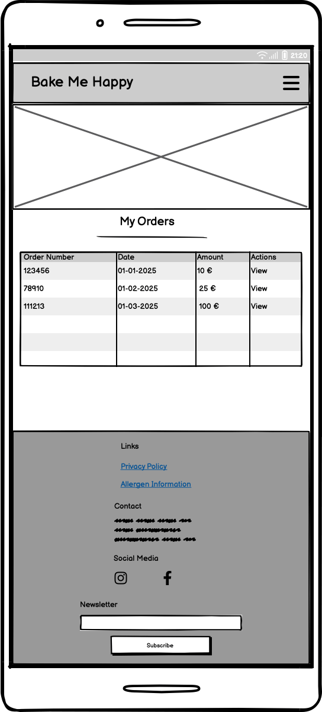
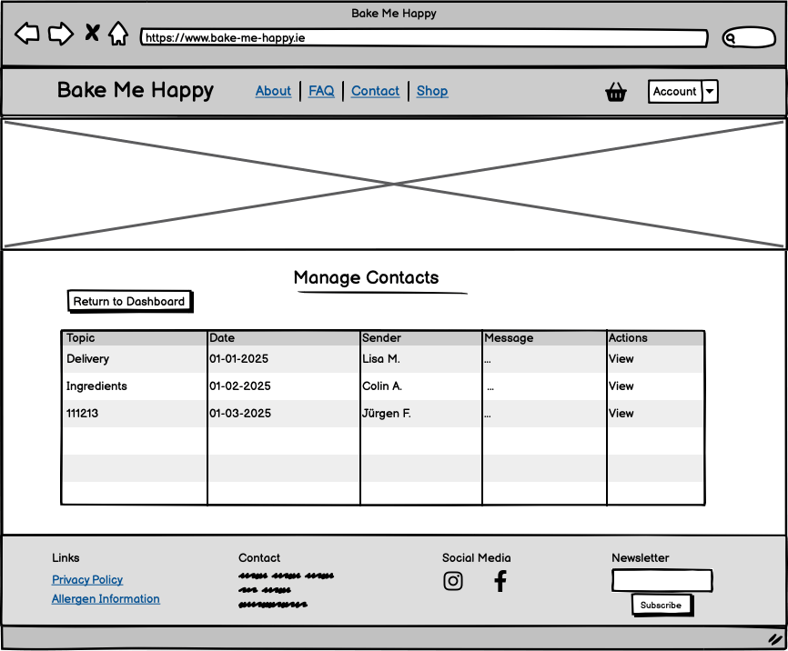
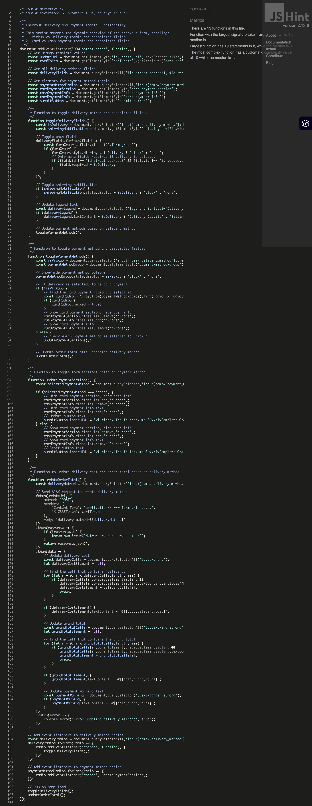
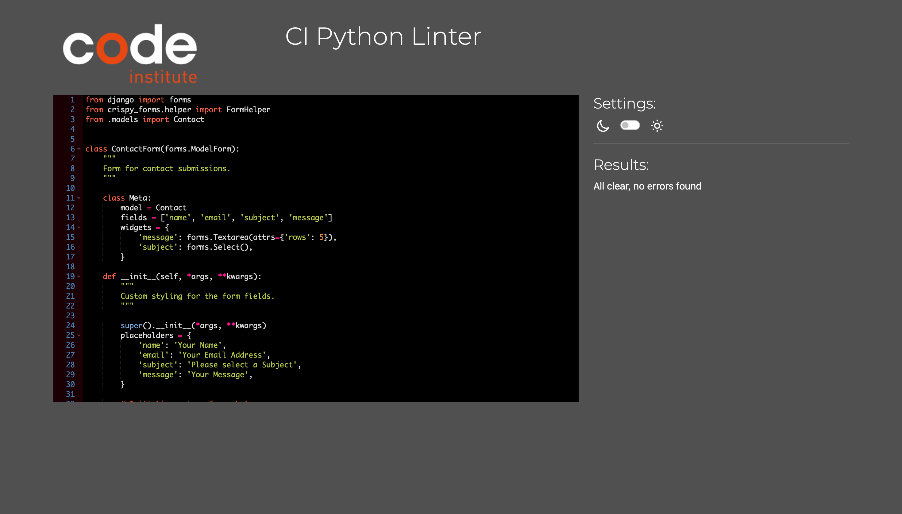
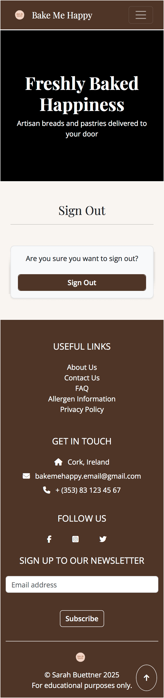

# Bake Me Happy

Bake Me Happy is an e-commerce website for a small, local online bakery. The shop offers a wide range of baked goods, mainly inspired by traditionally German recipes. Bake Me Happy is designed to provide a seamless shopping experience for customers, with a user-friendly interface and secure payment processing. It also features a user profile section for registered users, allowing them to manage their orders, reviews, and personal information, as well as a store management section for site admins to manage products, orders, customer contacts, and more.

Visit the deployed application [here](https://bake-me-happy-b9b73285e6cc.herokuapp.com).

## Table of Contents
1. [Project Planning](#project-planning)
    - [Agile Methodology](#agile-methodology)
        - [Sprints](#sprints)
        - [GitHub Projects](#github-projects)
    - [CRUD Functionality](#crud-functionality)
    - [Entity Relationship Diagram](#entity-relationship-diagram)
    - [Structure](#structure)
2. [Marketing](#marketing)
    - [Search Engine Optimisation](#search-engine-optimisation)
    - [Business Model](#business-model)
3. [Design Choices](#design-choices)
    - [Color Palette](#color-palette)
    - [Typography](#typography)
    - [Wireframes](#wireframes)
    - [Fixtures](#fixtures)
4. [User Experience (UX)](#user-experience-ux)
    - [Project Goals](#project-goals)
    - [User Stories](#user-stories)
5. [Features](#features)
    - [General](#general)
    - [Pages](#pages)
    - [Future Features](#future-features)
6. [Technologies Used](#technologies-used)
    - [Languages](#languages)
    - [Tools](#tools)
    - [Libraries, Frameworks, and Packages](#libraries-frameworks-and-packages)
    - [Tools and Programs](#tools-and-programs)
7. [Deployment](#deployment)
    - [GitHub](#github)
    - [Heroku](#heroku)
8. [Testing](#testing)
    - [Testing User Stories](#testing-user-stories)
    - [Code Validation](#code-validation)
        - [HTML](#html-validation)
        - [CSS](#css-validation)
        - [JavaScript](#javascript-validation)
        - [Python](#python-validation)
    - [Manual Testing](#manual-testing)
    - [Device and Browser Testing](#device-and-browser-testing)
        - [Device Compatibility](#device-compatibility)
        - [Browser Compatibility](#browser-compatibility)
    - [Bugs](#bugs)
    - [Accessibility](#accessibility)
9. [Finished Product](#finished-product)
10. [Credits](#credits)
    - [Content](#content)
    - [Media](#media)
    - [Code](#code)
11. [Acknowledgements](#acknowledgements)

[Back to top ⇧](#bake-me-happy)

## Project Planning

### Agile Methodology

Agile methodology played a crucial role in managing the development process. The project was divided into smaller sprints, each focusing on adding a specific feature or improving an existing function.

#### Sprints

**1st Sprint:**

The first sprint focused on setting up the basics of the application, including the base.html template which was used across all pages of the project.

**2nd Sprint:**

The second sprint focused on setting up the product app and its functionality. Bootstrap templates were customized to create a basic shop interface, including the different product views, as well as sorting and filtering functionality.

**3rd Sprint:**

The third sprint focused on setting up the basket app and its functionality. The basket provides a place for shoppers to view and update their planned purchases and easily access information about the costs associated with them.

**4th sprint:**

The fourth sprint focused on setting up the checkout app and its functionality. The checkout page uses Stripe to handle payments. This sprint relied heavily on webhook testing to ensure a smooth user experience.

**5th Sprint:**

The fifth sprint focussed on setting up the profile app and its functionality. Django allauth was implemented for user authentication, with customized tenplates to match the project's design.

**6th Sprint:**

The sixth sprint focused on setting up the favorites app and its functionality. Logged in users can easily add products to their favorites list and view them in a dedicated section within their profile.

**7th Sprint:**

The seventh sprint focused on setting up the basics of the store management app and its functionality. This sprint involved creating a dedicated section for store managers to manage products using a WYSIWYG editor.

**8th Sprint:**

The seventh sprint focused on setting up the reviews app and its functionality. Logged in users can create and update product reviews, which are displayed at the bottom of the relevant product detail page. Reviews may include ratings, which will update the existing product rating dynamically.

**9th Sprint:**

The ninth sprint focused on preparing the app for deployment with Heroku. A custom page was created to handle 404 errors. Email settings wer updated to allow Django to send out emails, as opposed to logging them to the terminal. The project was connected to AWS S3 to handle static and media files.

**10th Sprint:**

The tenth sprint focused on setting up the newsletter app and its functionality. Subscribers receive a confirmation email and are added to the subscribers list in the database. A context processor makes the newsletter accessible in the footer of every page of the project.

**11th Sprint:**

The eleventh sprint focused on setting up the contact app and its functionality. A contact page with several kinds of contact information as well as a contact form were created. Contacts via the form are added to the database.

**12th Sprint:**

The twelfth sprint focused on setting up the about app and its functionality, allowing users to learn more about the business and its staff. Separate models were created for the business and staff information.

**13th Sprint:**

The thirteenth sprint focused on improving on the store management app. A dashboard for admin users was created to easily manage products, contacts, subcribers, and the about content. The store management app brings a lot of the functionality from Django's */admin* panel to the front end, allowing store owners to maintain their website without the need to access backend pages. More pages were created for the about app, which can be managed from the store management dashboard.

**14th Sprint:**

The fourteenth sprint focused on implementing feedback from early user testing as well as initial code reviews. Improvements made included:
- Refactoring code that is being used in multiple places to avoid repetition.
- Updating page templates for improved screen reader compatibility and consistency.
- Improving page navigation.
- Updating the quantity selector to better suit the needs of the business.
- Creating additional account functionality with customized allauth templates.

**15th Sprint:**

The fifteenth sprint focused on improving the checkout process. Pickup and cash payment options were added, and address fields were updated to be more relevant to the business.

**16th Sprint:**

The final sprint focussed on polishing the project for submission. Code validation was performed alongside a final round of compatibility and feature testing.

#### GitHub Projects
 
GitHub Projects was an essential tool for tracking progress and managing tasks throughout the Agile development process. A Kanban-style board was used to track progress visually. Each issue was based on a user story and moved through the different phases of *To Do*, *In Progress*, and *Done*, following the corresponding sprints.
Custom labels were created to distinguish the issues visually. Labels were used to assign a priority, a functionality, and an Epic. 
 
A total of 37 user stories were created and completed across 9 Epics.

**Priorities, based on MOSCOW model of prioritization**
- *must-have*
- *should-have*
- *could-have* 
- *will-not-have*,

**Functionalities, based on CRUD model**
- C Create
- R read
- U update 
- D delete

**Epics** 
- Account Management
- Admin Access
- Basket & Checkout
- Browsing & Navigation
- Business Information 
- Favorites
- Newsletter
- Reviews
- Searching & Sorting

### CRUD Functionality

*CRUD* functionality has been implemented throughout the project to create an entirely usable experience for the user. Some examples of this include:
 
**Admin (superuser only)**
- *C*: Add new products. 
- *R*: View all products, subscribers, reviews, etc. 
- *U*: Update existing product listings. 
- *D*: Delete product listings and reviews. 
 
**Reviews (logged-in users only)**
- *C*: Create a new product review.
- *R*: View all reviews posted by this used. 
- *U*: Update reviews posted by this user.
- *D*: Delete reviews posted by this user.
 
**Basket (all users)**
- *C*: Add a new item to the basket.
- *R*: View basket contents.
- *U*: Update quantities of items in the basket.
- *D*: Delete basket contents or clear basket.

### Entity Relationship Diagram

[Django Extensions](https://django-extensions.readthedocs.io/en/latest/graph_models.html) was used to generate the ERD from Django models. 
[Graphviz](https://graphviz.org/) was used to render the ERD from the model relationships.

    
 Entity Relationship Diagram Image

    

### Structure
[Draw.io](https://www.draw.io) was used to visualize structure of the website and relationships between pages.

    
 Website Structure Image

    

[Back to top ⇧](#bake-me-happy)

## Marketing

### Search Engine Optimisation (SEO)

SEO is a crucial aspect of any website, and Bake Me Happy is no exception. To ensure Bake Me Happy ranks well on search engines such as Google and attracts the right audience, Bake Me Happy utilizes advanced Search Engine Optimization (SEO) techniques.
 
The following SEO strategies were implemented:

**Keyword Research:**

Tools like [Wordtracker](https://www.wordtracker.com/) were used to identify high-ranking keywords related to German baking, such as:
- "Authentic German bakery Ireland"
- "German bread delivery Ireland"
- "Traditional German cakes"
- "Online bakery Ireland"
 
These keywords will need to be reviewed and updated regularly, with tools like  [Google Analytics](https://developers.google.com/analytics).

**Content Optimisation:**

The website features high-quality, descriptive content that highlights the unique selling points of Bake Me Happy, such as its German heritage and fresh, handmade products.
The "About" section is rich in keywords and tells a compelling story that resonates with customers.

**Technical SEO:**

The website is mobile-friendly and responsive, ensuring a seamless user experience across devices.
Fast loading times are achieved through optimized images and efficient code.
A sitemap is submitted to search engines to ensure all pages are indexed.

**Local SEO:**

Bake Me Happy targets customers in Ireland, so local keywords like "German bakery Ireland" and "Irish online bakery" are prioritized.
As a real business, Bake Me Happy would be listed on Google My Business to improve visibility in local searches.

### Business Model

[Miro](https://miro.com) was used to create a business model canvas to visualize and define Bake Me Happy's key elements.

    
 Business Model Image

    

#### Company Description

Bake Me Happy is a small, friend-run bakery based in Ireland, specializing in authentic German baked goods. Their mission is to provide high-quality, freshly baked goods made from traditional recipes. The business was founded by German expats who wanted to share the nostalgic flavors of their homeland with their new community. Bake Me Happy offers a wide range of products, including rye breads, brioche rolls, and classic German cakes, all made fresh to order using traditional recipes and high-quality ingredients.

#### Marketing Strategy

Bake Me Happy's marketing strategy focuses on building a strong online presence and fostering community engagement. The bakery aims to create a welcoming and inclusive environment for customers, emphasizing the importance of community and connection. 

**Social Media Presence:**

A dedicated [Facebook Business Page]() is used to engage with customers, share updates, and promote new products.

    
 Facebook Business Page Image

    

 

**Email Marketing:**

Regular newsletters are sent to subscribers, featuring exclusive discounts, seasonal specials, and baking tips.

**Local Partnerships:**

For a real business, collaborations with local cafes and food markets help increase brand visibility.
Partnerships with food bloggers and influencers drive traffic to the website.

#### Customer Analysis

Bake Me Happy's primary customers are German expats living in Ireland who crave a taste of home. Their products appeal to families and individuals who value fresh, made-to-order bakery items made from real ingredients.

**Target Audience:**

- Primary: German expats in Ireland who crave the nostalgic flavors of home.
- Secondary: Irish locals interested in exploring authentic German baking.
- Tertiary: Food enthusiasts and customers seeking high-quality, preservative-free baked goods.

**Customer Needs:**
- Authentic, high-quality baked goods.
- Convenient online ordering and delivery.
- A connection to German culture and traditions.

#### Competitor Analysis

While there are several bakeries in Ireland, Bake Me Happy stands out due to its focus on authentic German baking. The market will need to be monitored continously to stay ahead of trends and ensure Bake Me Happy's offerings remain competitive.

**Direct Competitors:**
- Other online bakeries in Ireland offering artisanal or specialty baked goods.
- Local bakeries with delivery options.

**Indirect Competitors:**
- Supermarkets offering mass-produced baked goods.
- International online bakeries shipping to Ireland.

**Competitive Advantages:**
- Authentic German recipes and techniques.
- Fresh, handmade products with no preservatives.
- A strong brand story rooted in tradition and nostalgia.

#### SWOT Analysis

**Strengths:**
- Unique selling point: Authentic German baked goods.
- High-quality, preservative-free products.
- Strong emotional connection with German expats.
- Convenient online ordering and delivery.

**Weaknesses:**
- Limited marketing budget for traditional advertising.
- Limited physical presence (online-only).
- Reliance on delivery services, which may affect customer experience.
- Niche market appeal may limit customer base.

**Opportunities:**
- Expanding product range to include seasonal or festive items.
- Partnering with local cafes and restaurants.
- Offering the subscription service for regular deliveries.
- Leveraging social media to reach a wider audience.

**Threats:**
- Competition from established local bakeries and supermarkets.
- Fluctuation in ingredient and delivery costs.
- Economic downturns affecting discretionary spending.
- Changes in consumer preferences.

[Back to top ⇧](#bake-me-happy)

## Design Choices

### Color Palette

The color palette is based on the colors of the logo and the hero image. Colors have been picked to resemble bread and flour, to create a cohesive atmosphere and invite users to explore the baked goods on the website.
The palette was generated using [Coolors](https://coolors.co/image-picker).

    
 Color Palette Image

    

The main colors used in the project are:

- 4f3527 (Cafè Noir): Used for the footer, navigation bars, action buttons, button outlines, and card headers.

- F9F5F1 (Isabeliine): Used for the backrgound of the body.

- F1D4C6 (Pale Dogwood): Used for call to action sections on the home page.

- FFC107 (Amber): Used to highlight active links and stars in review forms as well as allergens on the product detail pages.

### Typography
Fonts were paired and imported using [Google Fonts](https://fonts.google.com).  
*Playfair Display* was chosen as the font for  headings, card titles, and the navbar brand.

Open Sans, with a fallback of sans-serif, was applied to the body, buttons, and prices.

    
 Playfair Display

    
     
     
    
 Open Sans

    

### Wireframes

[Balsamiq](https://balsamiq.com/) was used to create wireframes to display the pages' appearance on both mobile and larger devices. Since a lot of pages were going to be very similar in layout and functionality, not every page is represented in the table below. The templates have been adapted for the following pages: 

**Allergen Information**:
- Privacy Policy

**Store Management Views:**
- Manage Bakers
- Manage Orders
- Manage Subscribers
- Manage Products
- Manage Reviews
- Manage Contacts

**User Management Views:**
- My Orders
- My Favorites
- My Reviews

**Add / Edit View:**
- Add / Edit a Product
- Add / Edit a Review
- Add / Edit a Baker
- Edit About Content
- Edit Allergen Information
- Edit Privacy Policy

**Allauth Forms:**
- Sign In
- Sign Out
- Sign Up

**Allauth Texts:**
- Verifification / Reset Email sent

 
Page | Desktop Version | Mobile Version
--- | --- | ---
Home |  | 
About |   | 
Contact Us |  | 
FAQ |  | 
Allergen Information |  | 
Profile |  | 
Profile Views |  | 
Store Management |  | 
Store Management Views |  | 
Product List |  | 
Product Detail View |  | 
Add / Edit View |  | 
Allauth Forms |  | 
Allauth Texts |  | 
404 Page |  | 

### Fixtures

In order to create a realistic, immersive feeling for users, fixtures were created to upload products and product reviews.

- For the products app, three .json files were created - *occasions.json* to manage 6 occasions, *categories.json* to manage 3 categories, and *products.json* to manage 35 products.
- For the reviews app, one .json file - *reviews.json* -  was created to manage 23 product reviews.

[Back to top ⇧](#bake-me-happy)

## User Experience (UX)

### Project Goals

- The project incorporates a responsive design across different devices.
- The project provides an intuitive structure and navigation.
- The project has a pleasant, coherent design that invites users to explore the product range.
- The project allows users to register and access their profiles.
- The project allows users to have a pleasant shopping experience including a secure payment option.
- The project incorporates full *CRUD* functionality so the user can interact with the content.
- The project allows users to contact the site owners for questions and concerns.
- The project allows site admins to manage the pages content and contacts in one place.

### User Stories

#### Browsing & Navigation

- As a **shopper**, I can **view a list of products** so that **I can see all available options and make a selection**.

- As a **shopper**, I can **view detailed information about a specific product** so that **I can learn more about a product to make an informed purchasing decision**.

- As a **shopper**, I can **easily navigate between different pages** so that **I can find the information I need quickly**.

- As a **shopper**, I can **browse products by category** so that **I can easily find items within a specific area of interest**.

- As a **visually impaired  shopper**, I can **use a screen reader to access and understand the website content** so that **I can browse and interact with the site independently**.

#### Searching & Sorting 

- As a **shopper**, I can **search for products using keywords** so that **that I can quickly find items of interest**.

- As a **shopper**, I can **sort search results by different criteria** so that **I can prioritize the products I'm most interested in**.

- As a **shopper**, I can **easily see if my search returns no results** so that **I am not left confused or frustrated. and can adjust my search criteria**.

#### Account Management

- As a **shopper**, I can **create an account** so that **I can access personalized features and services**.

- As a **registered user**, I can **manage my profile information** so that **my information is accurate and up-to-date**.

- As a **registered user**, I can **delete my account** so that **my data is removed from the system**.

- As a **registered user**, I can **log in to my account using my credentials** so that **I can access my personalized information and features**.

- As a **registered user**, I can **reset my password** so that **regain access to my account**.

#### Basket & Checkout

- As a **shopper**, I can **add products to my basket** so that **I can purchase them later**.

- As a **shopper**, I can **view and update the contents of my basket** so that **I have control over my order before checkout**.

- As a **shopper**, I can **proceed to checkout from my basket** so that **I can complete my purchase**.

- As a **shopper**, I can **securely provide my payment information during checkout** so that **my transaction is processed safely**.

- As a **new shopper**, I can **checkout as a guest without creating an account** so that **I can quickly complete my purchase**.

#### Favorites

- As a **logged-in shopper**, I can **add products to my favorites list** so that **I can easily find them again later**.

As a **logged-in shopper**, I can **view my favorites list** so that **easily access products I've saved**.

- As a **logged-in shopper**, I can **remove products from my favorites list** so that **I can keep the list organized and up-to-date**.

- As a **logged-in shopper**, I can **add products from my favorites list directly to my basket** so that **I can quickly purchase them**.

#### Reviews

- As a **logged-in shopper**, I can **submit a review for a product I've purchased** so that **I can share my experience with other customers**.

- As a **shopper**, I can **review existing reviews** so that **I can make an educated purchasing decision**.

- As a **shopper**, I can **update my submitted reviews** so that **I can correct any mistakes I may have made**.

- As a **shopper**, I can **delete my published reviews** so that **I can remove information that is no longer relevant**.

#### Newsletter Signup

- As a **shopper**, I can **subscribe to the newsletter** so that **receive updates, promotions, and other relevant information**.

#### Admin Access

- As a **site admin**, I can **add, edit, and delete products in the catalogue** so that **I can keep the product information up-to-date**.

- As a **site admin**, I can **review product comments and ratings** so that **I can stay informed about my customers’ feedback**.

- As a **site admin**, I can **view my newsletter subscribers** so that **I can stay connected with my customers**.

- As a **site admin**, I can **view and manage orders** so that **I can track order status, process shipments, and handle customer inquiries**.

- As a **site admin**, I can **manage the website’s content** so that ** I can keep the website up-to-date and engaging**.

#### Business Information

- As a **shopper with allergies**, I can **view clear allergen information on product pages** so that **I can make informed choices about what I can safely consume**.

- As a **shopper**, I can **easily access the privacy policy** so that **I can understand how my data is collected, used, and protected**.

- As a **shopper**, I can **learn about the company's values and its team** so that **I can connect with the people that make it happen**.

-  As a **shopper**, I can **easily find the company’s contact information** so that **I can get in touch if needed**.

- As a **shopper**, I can **view detailed answers to frequently asked questions** so that ‘’I can find solutions to common problems**.

[Back to top ⇧](#bake-me-happy)

## Features

### General

A back to top button is available in the bottom right corner of every page to allow for easy navigation.

    
 Back to Top Button Image 

    

#### Responsiveness

Most people access the internet through moile devices. With that in mind, this website was designed to maintain as much of its functionality on smaller screens. Changes between the mobile and desktop layout include:

- Single product card presentation (one card per row as opposed to multiple small cards)
- Fewer columns displayed in tables
- Main navigation is turned into an offscreen canvas
- Secondary navigations use icons to save space

    
 Mobile Menu Image 

    

    
 Mobile Menu Image 

    

#### Header & Navigation

The navigation bar is the same across all pages to provide users with a familiar layout and allow them to focus on the content of each page. It contains the logo in the top left, doubling as a home page link. It also includes links to the main pages across the top, which will take on a different color when active. Its dark color provides a visual framing for the website.
The navigation bar contains a dynamically updated visual indicator of the shopping basket, which serves as a link to the baset.
The navigation bar includes a collapsible profile menu with changing options depending on the status of the user - guest user vs. logged in user vs site admin.
 
Secondary navigation bars appear on product and profile pages to allow quick and easy access to related functions. The product navigation bar includes a search field for product searches.
 
The header includes the main background image, which displays a welcome message across the home page. The image is visible on all front-facing pages except the home page, to avoid visual clutter. However, it is not rendered on admin-related pages like store management to allow for better focus.

    
 Header Image 

    

    
 No Header Image 

    

    
 Profile Navigation Bar Image 

    

#### Footer

The footer is the same across all pages to provide users with a familiar layout and allow them to focus on the content of each page. It has the same color as the navigation bars to provide the bottom frame of the content.
The footer contains business related links, including links to the proivacy policy and allergen informaiton pages which are only accessible from there. The footer also contains the business' contact information, including social media links. Lastly, the footer contains a simple newsletter signup fiels, allowing users to subscrbe by simply entering their email address.
 
Due to the density of informaiton in the footer, it appears quite large on mobile devices.

    
 Footer Image 

    

#### Toasts

User feedback is provided via toasts that appear in the top right corner of the screen. These toasts are color coded to be easily distinguishable.

    
 Danger Toast Image 

    

    
 Success Toast Image 

    

    
 Info Toast Image 

    

### Pages

#### Home

The home page contains multiple buttons to take the user to the store, including buttons to go straight to a filtered products, if users are only interested in a certain category.
The home page contains a clearly visible call to action, to invite users to start shopping or contact the business with questions, as well as a carousel displaying customer testimonials to showcase the positive relationship between the business and its customers.

    
 Carousel Image 

    

    
 Call to Action Image 

    

#### Contact Us

The contact us page contains multiple ways to contact the business, including a contact form. The contact form lets users select a subject from a predefined list to help sort and group incoming messages.

    
 Contact Us Form Image 

    

#### FAQ

The FAQ page lists the most frequently asked questions in individual accordions, with the questions always visible and the answers hidden until the accordion is clicked. Only one answer can be revealed at a time. This allows users to quickly scan through the list of questions and focus on the answer they were looking for.

    
 Accordion Image 

    

#### Product List

Each product is presented in a card. On larger screens, these cards have hover effect to provide visual feedback to the user. When the card image is clicked, the user is taken to the product detail page. 
Products can be added to the shopping basket with a quantitsy of 1 by clicking the basket icon. The heart icon adds products to the user's favorites list, if they are logged in. The heart icon appears empty by default but will toggle to a filled in heart for items that are on the favorites list.

    
 Product Card Image 

    

#### Product Details

The product detail page contains allr elevant information about a product. Clicking the image will open it in a new tab. Products can be added to the cart up to the maximum quantity available. Products can also be toggled on/off the favorites list.
Allergens are displayed prominently to alert users with allergies. 
Logged in users have the optopn to leave a product review, while guest users can only view existing reviews.

    
 Product Info Image 

    

#### Basket

In the basket, users can see the products they have added to their basket, as well as the total cost of the items. Item quantitites can be adjusted up to the maximum quantity available. A messageUsers can remove individual items and clear their entire basket. Clicking on a product image will redirect users to the product detail page. From the basket, users can move to the checkout page.
Depending on the total of the basket, a delivery fee may be added. The delivery charge is clearly visible on the basket page. Users receive feedback about how much more they'd have to spend in order to receive free shiping.

    
 Basket Detail Image 

    

#### Checkout

The checkout page contains a form for users to enter their shipping information. For logged in users, these fields will be prepopulated with the information from their profile. Logged in users can tick a box to save the entered information to their profile, while guest users see a prompt to log in or create an account to save their information.
Users can choose between two delivery options via radio buttons - delivery, which is the default option, or pickup. The only option to pay fot delivery is by card via Stripe, using the field at the bottom of the screen. If ppickup is selected, no delivery charge is added to the total. Additionally, when users select to pickup their order, a seecond set of radio buttons becomes visible, allowing users to choose between card payment via Stripe or cash payment on pickup. If cash payment is selected, the checkout process via Stripe is bypassed and the order confirmtion is displayed.
The country field on the checkout page is set to Ireland and cannot be changed.

    
 Checkout Pickup Image 

    

    
 Checkout Delivery Image 

    

#### Profile

In the profile page, users can view and update their personal information. By default, their information are read-only, and the editable form becomes visible by clicking the relevant button. The country field on the profile page is set to Ireland and cannot be changed, same as on the checkout page. Users can reset their password and delete their profile form this page as well.
A secondary navigation bar appears on the profile app to allow users to navigate between their relevant section and view their orders, favorite list, and product reviews. On mobile, the navigation bar uses icons to save space.
- The favorite list is presented as smaller product cards. Favorite products can be deleted from the list and added to the basket by clicking the corresponding buttons.
- Orders are displayed in a table. Clicking on the eye icon will open the oder confirmation in a new tab.
- Reviews are displayed in a table and can be viewed on the product page, edited, and deleted by clicking the correspondng button.

    
 Update Profile Image 

    

    
 Profile Table Image 

    

#### Store Management

The store management page allows admin users to easily maintain the website's content and monitor customer interactions. A dashboard at the top provides an easy overview of the sites main stats, such as amount of products, subscribers, reviews, etc. Each of these cards is clickable and will bring site admins to a more detailed view of that section. The dashboard is collapsed on mobile screens to save space.
These sections can also be reached by clicking the links in the category cards. Where applicable, store admins can view a table for eah of these sections containing more details as well as action buttons. This is very similar to the way information is presented in the user profile tables. If no tables are neccessary, site admins are brought straight to the relevant editor, where they can use a WYSISYG editor to make changes to the content.

    
 Dashboard Image 

    

    
 Store Management Table Image 

    

### Future Features

The following features could be implement in future versions of the site to improve both the user experience and site functionality:

- Social media sign in
- Additional payment options
- Dynamic order status updates for admins and users
- Recurring orders and subscriptions
- A newsletter signup pop up
- Promo codes at checkout
- Search options for admin views
- Search / sort by allergens and ingredients

[Back to top ⇧](#bake-me-happy)

## Technologies Used

### Languages

- [HTML5](https://en.wikipedia.org/wiki/HTML5)
- [CSS3](https://en.wikipedia.org/wiki/CSS)
- [Javascript](https://en.wikipedia.org/wiki/JavaScript)
- [Python](https://en.wikipedia.org/wiki/Python_(programming_language))
- [JSON](https://en.wikipedia.org/wiki/JSON)

### Tools and Programs

### Libraries, Frameworks, and Packages

[Back to top ⇧](#bake-me-happy)

## Deployment

### GitHub

### Heroku

[Back to top ⇧](#bake-me-happy)

## Testing
### Testing User Stories

#### Browsing & Navigation

As a **shopper**, I can **view a list of products** so that **I can see all available options and make a selection**.
- A list of all products is available on the products page.
- Each product is represented by a clickable product card including an image as well as the name, price, and rating, if available.
- Products can be sorted by a variety of criteria, including price, rating, and name.
- Products can be added to the Basket or Favorites from the product page.
- Clicking on the product image will take the user to the product detail page.

As a **shopper**, I can **view detailed information about a specific product** so that **I can learn more about a product to make an informed purchasing decision**.
- The product detail page includes the product name, price and serving size, rating, description, and a list of allergens.
- Products can be added to the Basket or Favorites from the product detail page.
- Clicking on the product image will open the image in a new window.

As a **shopper**, I can **easily navigate between different pages** so that **I can find the information I need quickly**.
- The navigation bar is available on every page and kept consistent across all pages.
- The navigation bar includes links to all pages, including the Basket, Profile, and Shop / Product pages.
- The logo and title are clockable links, returning shoppers back to the home page.
- The footer is available on every page and kept consistent across all pages.
- The footer includes additional links, such as allergen information, privacy policy, and contact information.
- The footer includes links to the business' social media accounts.

As a **shopper**, I can **browse products by category** so that **I can easily find items within a specific area of interest**.
- Products can be sorted by category as well as by occasion.
- Product counts indicate how many products are available in each category / occasion.
- Clicking on the category / occasion displayed on the product detail page will filter the product list to only include products in that category / occasion.

As a **visually impaired  shopper**, I can **use a screen reader to access and understand the website content** so that **I can browse and interact with the site independently**.
- The website is fully accessible using a screen reader.
- Pages have been structured using semantic HTML elements, with appropriate use of headings, lists, and other elements to convey information in a clear and meaningful way.
- All images have alt text that describes the image content.
- Links and buttons have aria labels that describe their purpose.

#### Searching & Sorting 

As a **shopper**, I can **search for products using keywords** so that **that I can quickly find items of interest**.
- The search bar is available in the product navigation bar.
- The search bar will return results for products that match the query in the title or description of the product.
- The search bar will return results for both German and English product names.

As a **shopper**, I can **sort search results by different criteria** so that **I can prioritize the products I'm most interested in**.
- The search results can be sorted by price, rating, and name.
- The search results can be sorted in ascending or descending order.
- The search results can be sorted by category or occasion.

As a **shopper**, I can **easily see if my search returns no results** so that **I am not left confused or frustrated. and can adjust my search criteria**.
- If no results are found, the user will be informed with a message.
- The user will be given the option to view all products.

#### Account Management

As a **shopper**, I can **create an account** so that **I can access personalized features and services**.
- The user can create an account by providing their email address, and creating a password.
- The user will receive a confirmation email to verify their email address.
- The user will be redirected to the login page after conforming their email address.

As a **registered user**, I can **manage my profile information** so that **my information is accurate and up-to-date**.
- The user can access their profile page from the navigation bar.
- The user can update their profile information, including their name, email address, contact details.
- The user can view their order history, favorite products, and product reviews from theirr profile page.

As a **registered user**, I can **delete my account** so that **my data is removed from the system**.
- The user can delete their account from the profile page.
- The user will be asked to confirm their decision to delete their account.
- Deleting the account will remove all personal information from the system.

As a **registered user**, I can **log in to my account using my credentials** so that **I can access my personalized information and features**.
- The user can log in to their account using their email address and password.
- The user can choose the "Remember me" option to stay logged in during login.

As a **registered user**, I can **reset my password** so that **regain access to my account**.
- The user can update their password on the profile page.
- The user can request a password reset email during the log in process.
- The user will receive feedback once their password jas been updated.

#### Basket & Checkout

As a **shopper**, I can **add products to my basket** so that **I can purchase them later**.
- Products can be added to the basket by clicking the "Add to Basket" button on the product detail page.
- Products can be added to the basket by clicking the "Add to Basket" icon on the product list page.

As a **shopper**, I can **view and update the contents of my basket** so that **I have control over my order before checkout**.
- The basket is accessible from the navigation bar.
- The basket displays the products added to it, along with their quantities and prices.
- The basket allows the user to update the quantities of products or remove them from the basket.
- The basket can be cleared completly with the "Clear Basket" button.

As a **shopper**, I can **proceed to checkout from my basket** so that **I can complete my purchase**.
- The checkout button is available in the basket.
- The checkout button will redirect the user to the checkout page.
- The checkout page will display the products in the basket, along with their quantities and prices.

As a **shopper**, I can **securely provide my payment information during checkout** so that **my transaction is processed safely**.
- The checkout page will display a secure payment form using Stripe.
- The user can enter their payment information securely.
- The user will receive a confirmation message after the payment is processed.
- The user will receive feedback for invalud payment informaiton.
- The user can choose to pay in cash on pickup, bypassing the payment process.

As a **new shopper**, I can **checkout as a guest without creating an account** so that **I can quickly complete my purchase**.
- The checkout page is available without requiring the user to create an account.
- The user can enter their payment information securely.
- The user will receive a confirmation message after the payment is processed.
- The user hs the option to create or log in to an account during checkout to save their information for future purchases.

#### Favorites

As a **logged-in shopper**, I can **add products to my favorites list** so that **I can easily find them again later**.
- The user can add products to their favorites list by clicking the "Add to Favorites" button on the product detail page.
- The user can add products to their favorites list by clicking the "Add to Favorites" icon on the product list page.

As a **logged-in shopper**, I can **view my favorites list** so that **easily access products I've saved**.
- The user can view their favorites list by clicking the "Favorites" link in the profile navigation bar.
- The favorites list displays the products added to it as small product cards.
- Clicking on the product card will redirect the user to the product detail page.

As a **logged-in shopper**, I can **remove products from my favorites list** so that **I can keep the list organized and up-to-date**.
- The user can remove products from their favorites list by clicking the "Remove from Favorites" button on the product detail page.
- The user can remove products from their favorites list by clicking the "Remove from Favorites" icon on the product list page.
- The user can remove products from their favorites list by clicking the "Remove from Favorites" icon on the favorites list page.
- Adding and removing products from the favorites list will toggle a heart icon on the product card.

As a **logged-in shopper**, I can **add products from my favorites list directly to my basket** so that **I can quickly purchase them**.
- The user can add products from their favorites list to their basket by clicking the "Add to Basket" button on their favorite list page.
- Adding a product from the favorites list to the basket will not remove it from the favorites list.

#### Reviews

As a **logged-in shopper**, I can **submit a review for a product I've purchased** so that **I can share my experience with other customers**.
- The user can submit a review by clicking the "Add Review" button on the product detail page.
- The "Add Review" button is only visible to logged-in users.

As a **shopper**, I can **review existing reviews** so that **I can make an educated purchasing decision**.
- Existing reviews are visible on the product detail page.
- Existing reviews are visible to all users, regardless of whether they are logged in.

As a **shopper**, I can **update my submitted reviews** so that **I can correct any mistakes I may have made**.
- The user can update their submitted reviews by clicking the "Edit Review" button on the review page in their profile.
- Updated reviews will appear in the review section of the product detail page.

As a **shopper**, I can **delete my published reviews** so that **I can remove information that is no longer relevant**.
- The user can delete their submitted reviews by clicking the "Delete Review" button on the review page in their profile.
- Deleted reviews will be removed from the review section of the product detail page.

#### Newsletter Signup

As a **shopper**, I can **subscribe to the newsletter** so that **receive updates, promotions, and other relevant information**.
- The user can subscribe to the newsletter by entering their email address on the newsletter signup form.
- The user will receive a confirmation message after subscribing to the newsletter.
- The newsletter signup form is available on all pages, in the footer.
- Subscribting to the newsletter will add the user to the subscribers list.

#### Admin Access

As a **site admin**, I can **add, edit, and delete products in the catalogue** so that **I can keep the product information up-to-date**.
- The admin user can add, edit, and delete products from the store management page.
- New and updated products will be visible on the product list page immediately
- Deleted products will be removed from the product list page.

As a **site admin**, I can **review product comments and ratings** so that **I can stay informed about my customers’ feedback**.
- The admin user can view and manage product comments and ratings on the store management page.
- The admin user can delete inappropriate reviews on the store management page.
- Reviews are displayed with detailed information, including the product name, the reviewer's name, the review text rating, and the date of the review.

As a **site admin**, I can **view my newsletter subscribers** so that **I can stay connected with my customers**.
- The admin user can view the newsletter subscribers list on the store management page.
- Subscribers are displayed with their email address and the date they subscribed.

As a **site admin**, I can **view and manage orders** so that **I can track order status, process shipments, and handle customer inquiries**.
- The admin user can view orders on the store management page.*
- The admin user can view order details, including the customer's name, email, shipping address, and order items.

*Note: For the purpose of this project, the admin user can view orders, but not manage them.

As a **site admin**, I can **manage the website’s content** so that ** I can keep the website up-to-date and engaging**.
- The admin user can add, edit, and delete content on the store management page.
- The site admin can manage product information as well as the content of the About Us, Allergen Informaiton, FAQ, and Privacy Policy pages.
- The site admin can update texts and, where applicable, images associated with these pages

#### Business Information

As a **shopper with allergies**, I can **view clear allergen information on product pages** so that **I can make informed choices about what I can safely consume**.
- The allergen information is displayed on the product detail page.
- The allergen information is displayed in a clear and concise manner.
- The user can view a full list of allergens on the Allergen Information page.
- The Allergen Information page is accessible from the footer.

As a **shopper**, I can **easily access the privacy policy** so that **I can understand how my data is collected, used, and protected**.
- The privacy policy is accessible from the footer.
- The privacy policy is accesible by all users, regardless of whether they are logged in.
- The privacy lays out the company's data collection and usage practices.

As a **shopper**, I can **learn about the company's values and its team** so that **I can connect with the people that make it happen**.
- The About Us page provides information about the company's values and its team.
- The About Us page is accessible from both the header abd footer.
-  The About Us page is accessible by all users, regardless of whether they are logged in.

As a **shopper**, I can **easily find the company’s contact information** so that **I can get in touch if needed**.
- The contact information is displayed on the Contact Us page.
- The contact information is accessible from the footer.
- The contact information is accessible by all users, regardless of whether they are logged in.
- In addition to the contact information, the Contact Us page provides a form for users to submit their questions or comments.
- Contacts submitted through the form will appear in the site admin's store management panel.

As a **shopper**, I can **view detailed answers to frequently asked questions** so that **I can find solutions to common problems**.
- The FAQ page provides answers to frequently asked questions.
- The FAQ page is accessible from both the header and footer.
- The FAQ page is accessible by all users, regardless of whether they are logged in.

### Code Validation

#### HTML Validation

[W3C Markup Validator](https://validator.w3.org/) was used to validate the HTML code of each templated page. HTML validation was performed via source code text input.

| Tested | Result | View Result | Pass/Fail |
--- | --- | --- | ---
|Home | No errors or warnings to show. | 

Validation Image

| Pass |
|About | No errors or warnings to show. | 

Validation Image

| Pass |
|FAQ | No errors or warnings to show. | 

Validation Image

| Pass |
|Contact Us | No errors or warnings to show. | 

Validation Image

| Pass |
|Allergen Information | No errors or warnings to show. | 

Validation Image

| Pass |
|Privacy policy | No errors or warnings to show. | 

Validation Image

| Pass |
|Products | No errors or warnings to show. | 

Validation Image

| Pass |
|Product Details | No errors or warnings to show. | 

Validation Image

| Pass |
|Basket | No errors or warnings to show. | 

Validation Image

| Pass |
|Checkout | No errors or warnings to show. | 

Validation Image

| Pass |
|Checkout Success | No errors or warnings to show. | 

Validation Image

| Pass |
|Profile | No errors or warnings to show. | 

Validation Image

| Pass |
|My Orders | No errors or warnings to show. | 

Validation Image

| Pass |
|My Favorties | No errors or warnings to show. | 

Validation Image

| Pass |
|My Reviews | No errors or warnings to show. | 

Validation Image

| Pass |
|Edit a Review | Validation errors relate to Summernote Widget. | 

Validation Image

| Pass |
|Sign Up | No errors or warnings to show. | 

Validation Image

| Pass |
|Sign In | No errors or warnings to show. | 

Validation Image

| Pass |
|Sign Out | No errors or warnings to show. | 

Validation Image

| Pass |
|Change Password | No errors or warnings to show. | 

Validation Image

| Pass |
|Forgot Password | No errors or warnings to show. | 

Validation Image

| Pass |
|Reset Password | No errors or warnings to show. | 

Validation Image

| Pass |
|Set New Password | No errors or warnings to show. | 

Validation Image

| Pass |
|Password Changed | No errors or warnings to show. | 

Validation Image

| Pass |
|Store Management | No errors or warnings to show. | 

Validation Image

| Pass |
|Manage Products | No errors or warnings to show. | 

Validation Image

| Pass |
|Add a Product | Validation errors relate to Summernote Widget. | 

Validation Image

| Pass |
|Edit a Product | Validation errors relate to Summernote Widget. | 

Validation Image

| Pass |
|Manage Reviews | No errors or warnings to show. | 

Validation Image

| Pass |
|View a Review | No errors or warnings to show. | 

Validation Image

| Pass |
|Manage Subscribers | No errors or warnings to show. | 

Validation Image

| Pass |
|Manage Orders | No errors or warnings to show. | 

Validation Image

| Pass |
|Manage Contacts | No errors or warnings to show. | 

Validation Image

| Pass |
|View a Contact | No errors or warnings to show. | 

Validation Image

| Pass |
|Edit About Content | Validation errors relate to Summernote Widget. | 

Validation Image

| Pass |
|Manage Baker Profiles | No errors or warnings to show. | 

Validation Image

| Pass |
|Edit a Baker Profile | Validation errors relate to Summernote Widget. | 

Validation Image

| Pass |
|Edit FAQ Content | Validation errors relate to Summernote Widget. | 

Validation Image

| Pass |
|Edit Privacy Policy Content | Validation errors relate to Summernote Widget. | 

Validation Image

| Pass |
|Edit Allergen Information Content | Validation errors relate to Summernote Widget. | 

Validation Image

| Pass |
|404 | No errors or warnings to show. | 

Validation Image

| Pass |

#### CSS Validation

[W3C CSS Validator](https://jigsaw.w3.org/css-validator/) was used to validate the custom CSS code.

| Tested | Result | View Result | Pass/Fail |
--- | --- | --- | ---
|about.css | No Error Found. | 

Validation Image

| Pass |
|base.css | No Error Found. | 

Validation Image

| Pass |
|checkout.css | No Error Found. | 

Validation Image

| Pass |
|home.css | No Error Found. | 

Validation Image

| Pass |
|products.css | No Error Found. | 

Validation Image

| Pass |
|profiles.css | No Error Found. | 

Validation Image

| Pass |
|reviews.css | No Error Found. | 

Validation Image

| Pass |

#### JavaScript Validation

[JSHint](https://jshint.com/) was used to validate the custom JavaScript code.

| Tested | Result | View Result | Pass/Fail |
--- | --- | --- | ---
|Back to Top Button JS | No errors | 

Validation Image

| Pass |
|delivery_toggle.js | No errors | 

Validation Image

| Pass |
|dropdown.js | No errors | 

Validation Image

| Pass |
|mobile_product_search.js | No errors | 

Validation Image

| Pass |
|navigation.js | No errors | 

Validation Image

| Pass |
|product_sorting.js | No errors | 

Validation Image

| Pass |
|profile_toggle.js | No errors | 

Validation Image

| Pass |
|quantity_dropdown.js | No errors | 

Validation Image

| Pass |
|star_rating.js | No errors | 

Validation Image

| Pass |
|stripe_elements.js | One undefined variable (Stripe )* | 

Validation Image

| Pass |
|Toasts JS | One undefined variable (Bootstrap)* | 

Validation Image

| Pass |

**Note:** These variables show up as undefined due to the modular nature of Django projects. They have no impact on the code and project functionality.

#### Python Validation

[PEP8 Online Check](https://pep8ci.herokuapp.com) was used to validate the custom Python code.

##### About

| Tested | Result | View Result | Pass/Fail |
--- | --- | --- | ---
|about/admin.py | All clear, no errors found | 

Validation Image

 | Pass |
|about/apps.py | All clear, no errors found | 

Validation Image

 | Pass |
|about/forms.py | All clear, no errors found | 

Validation Image

 | Pass |
|about/models.py | All clear, no errors found | 

Validation Image

 | Pass |
|about/urls.py | All clear, no errors found | 

Validation Image

| Pass |
|about/views.py | All clear, no errors found | 

Validation Image

| Pass |

##### Bake Me Happy

| Tested | Result | View Result | Pass/Fail |
--- | --- | --- | ---
|bake_me_happy/settings.py | All clear, no errors found | 

Validation Image

 | Pass |
|bake_me_happy/urls.py | All clear, no errors found | 

Validation Image

 | Pass |
|bake_me_happy/views.py | All clear, no errors found | 

Validation Image

 | Pass |

##### Basket

| Tested | Result | View Result | Pass/Fail |
--- | --- | --- | ---
|basket/apps.py | All clear, no errors found | 

Validation Image

| Pass |
|basket/contexts.py | All clear, no errors found | 

Validation Image

| Pass |
|basket/urls.py | All clear, no errors found | 

Validation Image

| Pass |
|basket/views.py | All clear, no errors found | 

Validation Image

| Pass |

##### Checkout

| Tested | Result | View Result | Pass/Fail |
--- | --- | --- | ---
|checkout/admin.py | All clear, no errors found | 

Validation Image

| Pass |
|checkout/apps.py | All clear, no errors found | 

Validation Image

| Pass |
|checkout/forms.py | All clear, no errors found | 

Validation Image

| Pass |
|checkout/models.py | All clear, no errors found | 

Validation Image

| Pass |
|checkout/signals.py | All clear, no errors found | 

Validation Image

| Pass |
|checkout/urls.py | All clear, no errors found | 

Validation Image

| Pass |
|checkout/views.py | All clear, no errors found | 

Validation Image

| Pass |
|checkout/webook_handler.py | All clear, no errors found | 

Validation Image

| Pass |
|checkout/webhooks.py | All clear, no errors found | 

Validation Image

| Pass |

##### Contact

| Tested | Result | View Result | Pass/Fail |
--- | --- | --- | ---
|contact/admin.py | All clear, no errors found | 

Validation Image

| Pass |
|contact/forms.py | All clear, no errors found | 

Validation Image

| Pass |
|contact/models.py | All clear, no errors found | 

Validation Image

| Pass |
|contact/urls.py | All clear, no errors found | 

Validation Image

| Pass |
|contact/views.py | All clear, no errors found | 

Validation Image

| Pass |

##### Favorites

| Tested | Result | View Result | Pass/Fail |
--- | --- | --- | ---
|favorites/models.py | All clear, no errors found | 

Validation Image

| Pass |
|favorites/urls.py | All clear, no errors found | 

Validation Image

| Pass |
|favorites/views.py | All clear, no errors found | 

Validation Image

| Pass |

##### Home

| Tested | Result | View Result | Pass/Fail |
--- | --- | --- | ---
|home/urls.py | All clear, no errors found | 

Validation Image

| Pass |
|home/views.py | All clear, no errors found | 

Validation Image

| Pass |

##### Newsletter

| Tested | Result | View Result | Pass/Fail |
--- | --- | --- | ---
|newsletter/admin.py | All clear, no errors found | 

Validation Image

| Pass |
|newsletter/contexts.py | All clear, no errors found | 

Validation Image

| Pass |
|newsletter/forms.py | All clear, no errors found | 

Validation Image

| Pass |
|newsletter/models.py | All clear, no errors found | 

Validation Image

| Pass |
|newsletter/urls.py | All clear, no errors found | 

Validation Image

| Pass |
|newsletter/views.py | All clear, no errors found | 

Validation Image

| Pass |

##### Products

| Tested | Result | View Result | Pass/Fail |
--- | --- | --- | ---
|products/admin.py | All clear, no errors found | 

Validation Image

| Pass |
|products/forms.py | All clear, no errors found | 

Validation Image

| Pass |
|products/models.py | All clear, no errors found | 

Validation Image

| Pass |
|products/urls.py | All clear, no errors found | 

Validation Image

| Pass |
|products/views.py | All clear, no errors found | 

Validation Image

| Pass |
|products/widgets.py | All clear, no errors found | 

Validation Image

| Pass |

##### Profiles

| Tested | Result | View Result | Pass/Fail |
--- | --- | --- | ---
|profiles/admin.py | All clear, no errors found | 

Validation Image

| Pass |
|profiles/forms.py | All clear, no errors found | 

Validation Image

| Pass |
|profiles/models.py | All clear, no errors found | 

Validation Image

| Pass |
|profiles/urls.py | All clear, no errors found | 

Validation Image

| Pass |
|profiles/views.py | All clear, no errors found | 

Validation Image

| Pass |

##### Reviews

| Tested | Result | View Result | Pass/Fail |
--- | --- | --- | ---
|reviews/admin.py | All clear, no errors found | 

Validation Image

| Pass |
|reviews/forms.py | All clear, no errors found | 

Validation Image

| Pass |
|reviews/models.py | All clear, no errors found | 

Validation Image

| Pass |
|reviews/urls.py | All clear, no errors found | 

Validation Image

| Pass |
|reviews/views.py | All clear, no errors found | 

Validation Image

| Pass |

#### JSON Validation

[JSON Formatter & Validator](https://jsonformatter.curiousconcept.com) was used to validate the JSON code of the fixtures.

| Tested | Result | View Result | Pass/Fail |
--- | --- | --- | ---
|categories.json | All clear, no errors found | 

Validation Image

| Pass |
|occasions.json | All clear, no errors found | 

Validation Image

| Pass |
|products.json | All clear, no errors found | 

Validation Image

| Pass |
|faq.json | All clear, no errors found | 

Validation Image

| Pass |
|bakers.json | All clear, no errors found | 

Validation Image

| Pass |
|reviews.json | All clear, no errors found | 

Validation Image

| Pass |

### Manual Testing

### Device and Browser Testing
#### Device Compatibility

Device | Outcome | Pass/Fail
| --- | --- | --- |
| iPhone 13 Mini | No appearance, responsiveness, or functionality issues. | TBA |
| iPad 9th Generation | No appearance, responsiveness, or functionality issues. | TBA |
| iPad Pro (9.7-inch) | No appearance, responsiveness, or functionality issues. | TBA |
| MacBook Air 13" | No appearance, responsiveness, or functionality issues. | TBA |
| Asus Vivobook Pro 15 | No appearance, responsiveness, or functionality issues. | TBA |
| Black Shark PAR-HOA | No appearance, responsiveness, or functionality issues. | TBA |
| Samsung Galaxy S23 | No appearance, responsiveness, or functionality issues. | TBA |

#### Browser Compatibility

Browser | Outcome | Pass/Fail
| --- | --- | --- |
| Safari | No appearance, responsiveness, or functionality issues. | TBA |
| Google Chrome | No appearance, responsiveness, or functionality issues. | TBA |
| Microsoft Edge | No appearance, responsiveness, or functionality issues. | TBA |
| Mozilla Firefox | No appearance, responsiveness, or functionality issues. | TBA |
| JoyUI Native Browsers | No appearance, responsiveness, or functionality issues. | TBA |

### Bugs

| Feature | Bug | Fix |
|---|---|---|
| Feature | Bug | Fix |
| Feature | Bug | Fix |

### Accessibility
[Lighthouse](https://developer.chrome.com/docs/lighthouse/overview) in [Chrome DevTools](https://developer.chrome.com/docs/devtools/) was used to measure the page's quality, focusing on performance, accessibility, best practices, and SEO scores.
 
The scores are ordered as *Performance* - *Accessibility* - *Best Practices* - *SEO*.

| Tested | Result | View Result | Pass/Fail |
--- | --- | --- | ---
|Home | TBA | 

Lighthouse Image

| TBA |
|About | TBA | 

Lighthouse Image

| TBA |
|FAQ | TBA | 

Lighthouse Image

| TBA |
|Contact Us | TBA | 

Lighthouse Image

| TBA |
|Product List | TBA | 

Lighthouse Image

| TBA |
|Product Details | TBA | 

Lighthouse Image

| TBA |
|Basket | TBA | 

Lighthouse Image

| TBA |
|Checkout | TBA | 

Lighthouse Image

| TBA |
|Checkout-Success | TBA | 

Lighthouse Image

| TBA |
|Profile | TBA | 

Lighthouse Image

| TBA |
|My Orders | TBA | 

Lighthouse Image

| TBA |
|My Reviews | TBA | 

Lighthouse Image

| TBA |
|My Favorites | TBA | 

Lighthouse Image

| TBA |
|Store Management | TBA | 

Lighthouse Image

| TBA |
|Manage Products | TBA | 

Lighthouse Image

| TBA |
|Add a Product | TBA | 

Lighthouse Image

| TBA |
|Edit a Product | TBA | 

Lighthouse Image

| TBA |
|Manage Reviews | TBA | 

Lighthouse Image

| TBA |
|Manage subscribers | TBA | 

Lighthouse Image

| TBA |
|Manage orders | TBA | 

Lighthouse Image

| TBA |
|Manage contacts | TBA | 

Lighthouse Image

| TBA |
|Edit About Content | TBA | 

Lighthouse Image

| TBA |
|Manage Baker Profiles | TBA | 

Lighthouse Image

| TBA |
|Edit Baker Profiles | TBA | 

Lighthouse Image

| TBA |
|Manage FAQ | TBA | 

Lighthouse Image

| TBA |
|Manage Allergen Information | TBA | 

Lighthouse Image

| TBA |
|Manage Privacy Policy | TBA | 

Lighthouse Image

| TBA |
|Sign In | TBA | 

Lighthouse Image

| TBA |
|Sign Up | TBA | 

Lighthouse Image

| TBA |
|Sign Out | TBA | 

Lighthouse Image

| TBA |
|404 | TBA | 

Lighthouse Image

| TBA |

[Back to top ⇧](#bake-me-happy)

## Finished Product

Page | Desktop Version | Mobile Version
--- | --- | ---
Home |  | 
About |  | 
FAQ |  | 
Contact Us |  | 
Allergen Information |  | 
Profile |  | 
Favorites |  | 
Orders |  | 
Reviews |  | 
Product List |  | 
Product Detail |  | 
Store Management |  | 
Manage Products |  | 
Manage Contacts |  | 
Sign In |  | 
Sign Up |  | 
Sign Out |  | 
404 Page |  | 

[Back to top ⇧](#bake-me-happy)

## Credits

### Content

### Media

### Code

[Back to top ⇧](#bake-me-happy)

## Acknowledgements

[Back to top ⇧](#bake-me-happy)